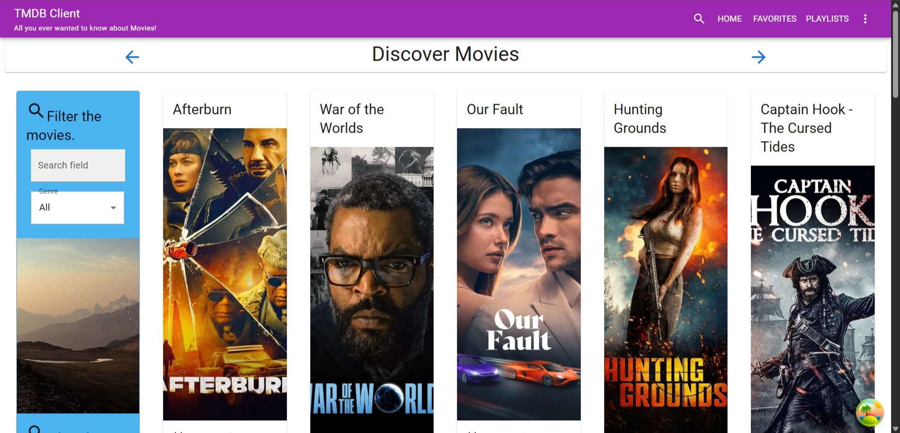
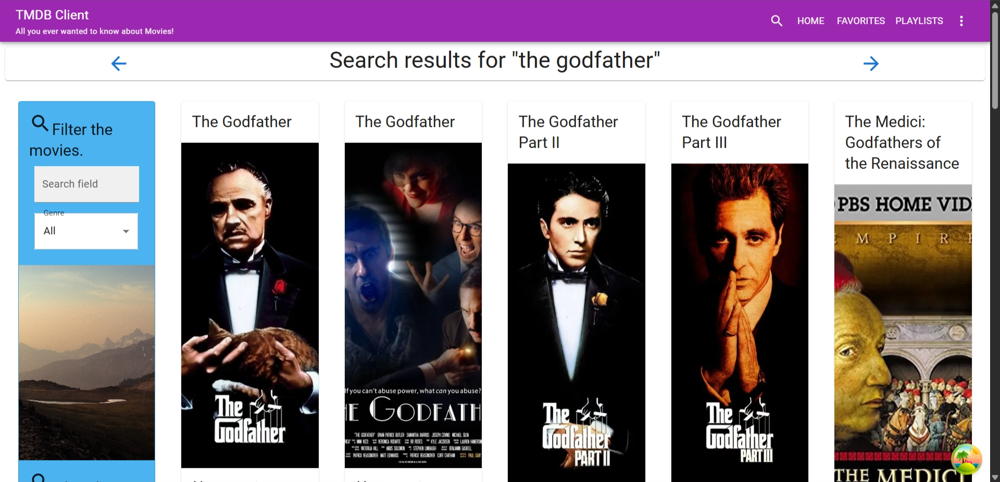

# wad2-react-ca
Web App Development 2 - React CA



## Description
This is a simple React application that demonstrates the use of React components, state management, and routing. The application allows users to view a list of items and see details for each item. The app fetches data from the TMDB (The Movie Database) API to display movie information.

## Features
- View a list of movies
- Click on a movie to view its details
- Uses TMDB API to fetch movie data

## Screenshots



## Installation
1. Clone the repository:
   ```bash
   git clone https://github.com/tiredwork/wad2-react-ca.git
   cd wad2-react-ca
   ```

2. Install dependencies:
   ```bash
   npm install
   ```
3. Create a `.env` file in the root directory and add your TMDB API key:
   ```env
    REACT_APP_TMDB_API_KEY=your_tmdb_api_key
    ```
4. Start the development server:
    ```bash
    npm run dev
    ```
5. Open your browser and navigate to the localhost address that is displayed in the terminal (e.g., `http://localhost:5173`) to view the application.

## Technologies Used
- React
- npm
- Vite
- TMDB API
